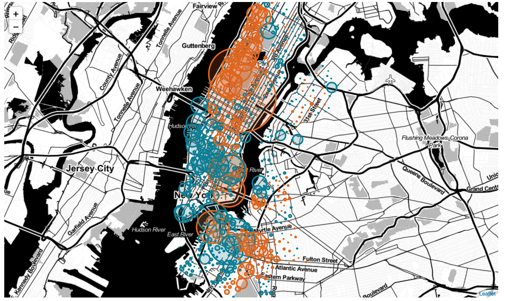

## Homework 8

#### Assignment 1
In this assignment, I created a plot showing the arrival/departure status of Citi Bike stations in Manhattan. I used folium to create an interactice map.

In the map, orange circles refer to the station that has more departure trips than arrival trips, blue vice versa. The radius of the circle indicates the magnitude of net departure. 

Interactive map can be found in this notebook [here](HW8_A1_my1826.ipynb)

#### Assignment 2
Report on citibike research. 
[link](https://www.authorea.com/users/249736/articles/336191-scholarly-article)